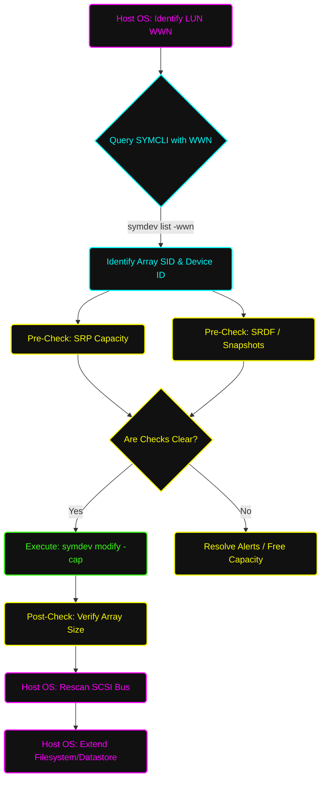

# 📈 Standard Operating Procedure: End-to-End LUN Expansion

**System Architecture:** Dell EMC PowerMax / VMAX  
**Document Status:** Standard Operating Procedure (SOP)  
**Task Focus:** Volume Expansion (Host WWN to Array)  

---

## 📑 Table of Contents
1. [🎯 Purpose & Scope](#1-purpose--scope)
2. [🗺️ LUN Expansion Workflow (Mermaid)](#2-lun-expansion-workflow-mermaid)
3. [🔍 Phase 1: Identify Array and Device via WWN](#3-phase-1-identify-array-and-device-via-wwn)
4. [🛑 Phase 2: Pre-Expansion Checks](#4-phase-2-pre-expansion-checks)
5. [🛠️ Phase 3: Array-Side LUN Expansion](#5-phase-3-array-side-lun-expansion)
6. [✅ Phase 4: Post-Expansion Checks & Host Rescan](#6-phase-4-post-expansion-checks--host-rescan)

---

## 🗺️ 2. LUN Expansion Workflow (Mermaid)

## 1. 🎯 Purpose & Scope
This SOP outlines the end-to-end process for expanding an existing Logical Unit Number (LUN). It covers the complete lifecycle starting from a host-provided LUN WWN, identifying the target storage array, performing safety pre-checks, executing the expansion, and validating the expansion on both the array and host sides.

## 3. 🔍 Phase 1: Identify Array and Device via WWN
When a system administrator requests an expansion, they typically provide the host-side NAA/WWN (e.g., 60000970000297900123533030303134).

### Method A: Using SYMCLI (Recommended)
Use Solutions Enabler to query all connected arrays for the specific WWN:
> symdev list -wwn <Host_Provided_WWN>

* **Output:** The command will return the **Symmetrix ID (SID)** and the **Device ID (Hex)**.

### Method B: Manual WWN Decoding (PowerMax/VMAX)
A Dell EMC WWN contains the array and device info embedded within it:
* Format: 6000097 + [Array Serial Snippet] + [Device ID]
* Example: 60000970000297900123533030303134
  * 6000097 = Dell EMC IEEE prefix.
  * ...2979... = Corresponds to Array SID ending in 2979.
  * ...303134 = Converts from Hex-ASCII to Device ID 014.

## 4. 🛑 Phase 2: Pre-Expansion Checks
Do not proceed with expansion until the following constraints are validated.

### 4.1 Storage Resource Pool (SRP) Capacity
Ensure the array has enough physical capacity to accommodate the expansion.
> symcfg -sid <SID> list -srp -detail

* **Validation:** Total SRP utilization must be well below 80%.

### 4.2 Snapshot & SRDF Status
LUNs with active snapshots or in certain SRDF replication states require special handling.
> symdev -sid <SID> show <Device_ID>

* **Validation 1 (Snapshots):** If the LUN has active SnapVX snapshots, older PowerMaxOS versions may block expansion. Modern PowerMaxOS allows it, but it is best practice to verify OS compatibility.
* **Validation 2 (SRDF):** If the device is SRDF paired, identify the RDF Group. Expanding an SRDF paired device expands *both* the R1 and R2 devices simultaneously in modern code.
> symrdf -sid <SID> -rdfg <Group#> -devs <Device_ID> query

* Ensure the pair state is **Synchronized** (SRDF/S) or **Consistent** (SRDF/A) before expanding.

## 5. 🛠️ Phase 3: Array-Side LUN Expansion
Once pre-checks are clear, proceed with the expansion.

### 5.1 Execute the Expansion Command
To expand the LUN to a **new total capacity** (Note: Do not enter the *additional* size, enter the *new total* size).
> symdev -sid <SID> modify <Device_ID> -cap <New_Total_Size> -captype <GB|TB|MB>

* **Example:** If a LUN is 500GB and you need to add 200GB, the command is:
  symdev -sid <SID> modify 01A4 -cap 700 -captype GB

### 5.2 Expand SRDF Paired Device (If Applicable)
For paired devices, the command syntax usually requires acknowledging the RDF expansion:
> symrdf -sid <SID> -rdfg <Group#> -devs <Device_ID> modify -cap <New_Total_Size> -captype GB

## 6. ✅ Phase 4: Post-Expansion Checks & Host Rescan

### 6.1 Array-Side Verification
Confirm the new capacity is reflected on the array.
> symdev -sid <SID> show <Device_ID>

* **Validation:** Verify the Capacity field matches the intended new total size.

### 6.2 Host-Side Rescan & Expansion
Notify the Server/Virtualization team to rescan and expand the filesystem.

* **VMware ESXi:**
  1. vCenter -> Host -> Storage -> **Rescan Storage**.
  2. Select Datastore -> **Increase Datastore Capacity** -> Select the expanded LUN.
* **Windows Server:**
  1. Open **Disk Management** (diskmgmt.msc).
  2. Action -> **Rescan Disks**.
  3. Right-click the volume -> **Extend Volume**.
* **Linux (RedHat / CentOS / Ubuntu):**
  1. Rescan the SCSI bus: echo 1 > /sys/class/block/sdX/device/rescan (for each path) or run /usr/bin/rescan-scsi-bus.sh -s.
  2. Resize Multipath (if used): multipathd resize map <mpath_name>.
  3. Extend the LVM/Filesystem:
    * LVM: pvresize /dev/mapper/<mpath_name> -> lvextend -r -l +100%FREE /dev/vg/lv
    * XFS: xfs_growfs /mountpoint
    * EXT4: resize2fs /dev/mapper/<mpath_name>
