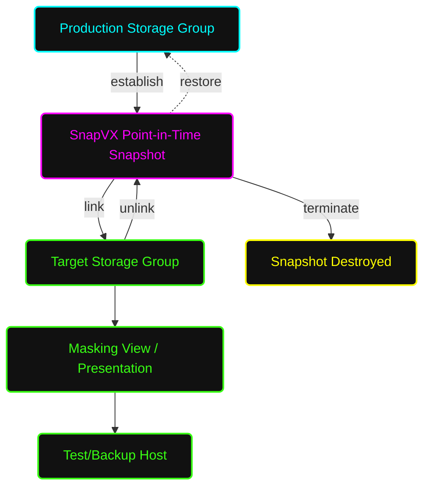

# 📸 Standard Operating Procedure: SnapVX Creation & Management

**System Architecture:** Dell EMC PowerMax / VMAX All Flash  
**Document Status:** Standard Operating Procedure (SOP)  
**Task Focus:** Local Replication (SnapVX) & Copy Data Management  

---

## 📑 Table of Contents
1. [🎯 Purpose & Scope](#1-purpose--scope)
2. [📖 Layman's Glossary (Simple Explanations)](#2-laymans-glossary-simple-explanations)
3. [🗺️ SnapVX Logical Workflow (Mermaid)](#3-snapvx-logical-workflow-mermaid)
4. [🛑 Phase 1: Pre-Requisites & Validation](#4-phase-1-pre-requisites--validation)
5. [📸 Phase 2: Creating a SnapVX Snapshot](#5-phase-2-creating-a-snapvx-snapshot)
6. [🔗 Phase 3: Linking to a Target (Test/Dev)](#6-phase-3-linking-to-a-target-testdev)
7. [🧹 Phase 4: Unlinking & Terminating](#7-phase-4-unlinking--terminating)
8. [⏪ Phase 5: Restoring a Storage Group](#8-phase-5-restoring-a-storage-group)

---

<a name="2-laymans-glossary-simple-explanations"></a>
## 📖 2. Layman's Glossary (Simple Explanations)
If you are new to storage administration, here is what these technical terms actually mean in plain English:

* **SnapVX:** The software engine inside the storage array that takes "pictures" of your data.
* **Point-in-Time Snapshot:** Imagine taking a photograph of a spreadsheet at 12:00 PM. No matter how much you change the spreadsheet at 1:00 PM, the photograph still shows exactly what it looked like at 12:00 PM. 
* **Redirect-on-Write (RoW):** A space-saving trick. If you change a sentence in a document after taking a snapshot, the system doesn't erase the old sentence. Instead, it writes the new sentence on a blank sticky note and places it on top. The original snapshot still sees the old sentence underneath.
* **Storage Group (SG):** A logical folder or "bucket" that holds a specific group of hard drives (LUNs) meant for a single application or server.
* **Time-To-Live (TTL):** An expiration date or "self-destruct timer." It ensures you don't accidentally leave snapshots sitting around forever filling up your expensive storage.
* **Linking / Target SG:** Giving someone a photocopy of your snapshot to play with. You "link" the snapshot to a new, temporary bucket (Target SG) so a test server can read and write to it without ruining the original production data.
* **Masking View:** The security guard and map. It tells the storage array exactly which server is allowed to see which bucket of data.
* **Restore:** The ultimate "Undo" button. This erases all current changes and forcefully rewinds the production data back to exactly how it looked in the snapshot.

---

<a name="3-snapvx-logical-workflow-mermaid"></a>
## 🗺️ 3. SnapVX Logical Workflow (Mermaid)



<a name="1-purpose--scope"></a>
## 1. 🎯 Purpose & Scope
This SOP outlines the procedure for using Dell EMC **TimeFinder SnapVX**. SnapVX creates highly efficient, Redirect-on-Write (RoW) point-in-time copies of Storage Groups (SGs). These snapshots can be used for local backups, rapid restores, or linked to target SGs for presentation to DEV/TEST/Backup servers.

<a name="4-phase-1-pre-requisites--validation"></a>
## 4. 🛑 Phase 1: Pre-Requisites & Validation

### 4.1 Check Source Storage Group
Identify the production SG and ensure it is in a healthy state.
```bash
symsg -sid <SID> show <Production_SG_Name>
```

### 4.2 Verify Active Snapshots & Capacity
Before taking a new snapshot, check if previous snapshots exist and verify the array has sufficient Metadata and Storage Resource Pool (SRP) capacity.
```bash
symsnapvx -sid <SID> -sg <Production_SG_Name> list
symcfg -sid <SID> list -srp -detail
```
* **Validation:** SRP utilization should ideally be below 80%. While snapshots are metadata-only at creation, subsequent host writes will consume SRP space.

<a name="5-phase-2-creating-a-snapvx-snapshot"></a>
## 5. 📸 Phase 2: Creating a SnapVX Snapshot

### 5.1 Establish the Snapshot with TTL
Always use a **Time-To-Live (TTL)**. This prevents forgotten snapshots from consuming array capacity indefinitely. 
```bash
symsnapvx -sid <SID> -sg <Production_SG_Name> -name <Snapshot_Name> establish -ttl -val <Days> -type days
```

* **Example:** Create a snapshot named `DB_PrePatch_Snap` that auto-expires in 7 days:
```bash
symsnapvx -sid 1234 -sg PROD_DB_SG -name DB_PrePatch_Snap establish -ttl -val 7 -type days
```

### 5.2 Verify Snapshot Creation
Ensure the snapshot state shows as **Established**.
```bash
symsnapvx -sid <SID> -sg <Production_SG_Name> list -detail
```

<a name="6-phase-3-linking-to-a-target-testdev"></a>
## 6. 🔗 Phase 3: Linking to a Target (Test/Dev)
To make the snapshot readable/writable by another host (like a test server), you must "link" it to a Target Storage Group.

### 6.1 Create Target Storage Group (If not already created)
The target SG must contain the exact same number of LUNs, and each LUN must be the exact same size as the source SG.
```bash
symsg -sid <SID> create <Target_SG_Name>
```
* *(Note: In modern PowerMaxOS, SnapVX can automatically create the target LUNs during the link process if the SG is empty).*

### 6.2 Link the Snapshot
Link the snapshot to the target SG. The `-copy` flag is optional but recommended if the test host will heavily write to the linked devices (creates a full clone). For standard testing, omit `-copy` for pointers only.
```bash
symsnapvx -sid <SID> -sg <Production_SG_Name> -snapshot_name <Snapshot_Name> link -lnsg <Target_SG_Name>
```

### 6.3 Present Target SG to Host
If the target SG is not already in a Masking View, add it to the Test Host's Masking View.
```bash
symaccess -sid <SID> create view -name <Test_MV_Name> -sg <Target_SG_Name> -pg <Test_PG> -ig <Test_IG>
```
* **Host Action:** Rescan the SCSI bus on the test host and mount the file systems.

<a name="7-phase-4-unlinking--terminating"></a>
## 7. 🧹 Phase 4: Unlinking & Terminating
When the test is complete or the backup is finished, you must clean up the relationships.

### 7.1 Unmount on Host
* **Critical:** The Server Admin *must* unmount the filesystem/datastore on the Test Host before unlinking to prevent OS data corruption panics.

### 7.2 Unlink the Target SG
Sever the connection between the Snapshot and the Target SG.
```bash
symsnapvx -sid <SID> -sg <Production_SG_Name> -snapshot_name <Snapshot_Name> unlink -lnsg <Target_SG_Name>
```

### 7.3 Terminate the Snapshot (Manual Deletion)
If you did not use a TTL, or if you want to delete it before the TTL expires:
```bash
symsnapvx -sid <SID> -sg <Production_SG_Name> -snapshot_name <Snapshot_Name> terminate
```

<a name="8-phase-5-restoring-a-storage-group"></a>
## 8. ⏪ Phase 5: Restoring a Storage Group
**WARNING: This is a destructive action.** It will overwrite the current production data with the state of the snapshot. 

### 8.1 Stop Host I/O
Shut down the application and unmount the filesystem on the Production Host to ensure cache is flushed and no inflight I/O is active.

### 8.2 Execute the Restore
```bash
symsnapvx -sid <SID> -sg <Production_SG_Name> -snapshot_name <Snapshot_Name> restore
```

### 8.3 Terminate the Restore Session
Once the data is fully restored and verified, terminate the restore relationship.
```bash
symsnapvx -sid <SID> -sg <Production_SG_Name> -snapshot_name <Snapshot_Name> terminate -restored
```
* **Host Action:** Remount the production filesystems and start the application.
