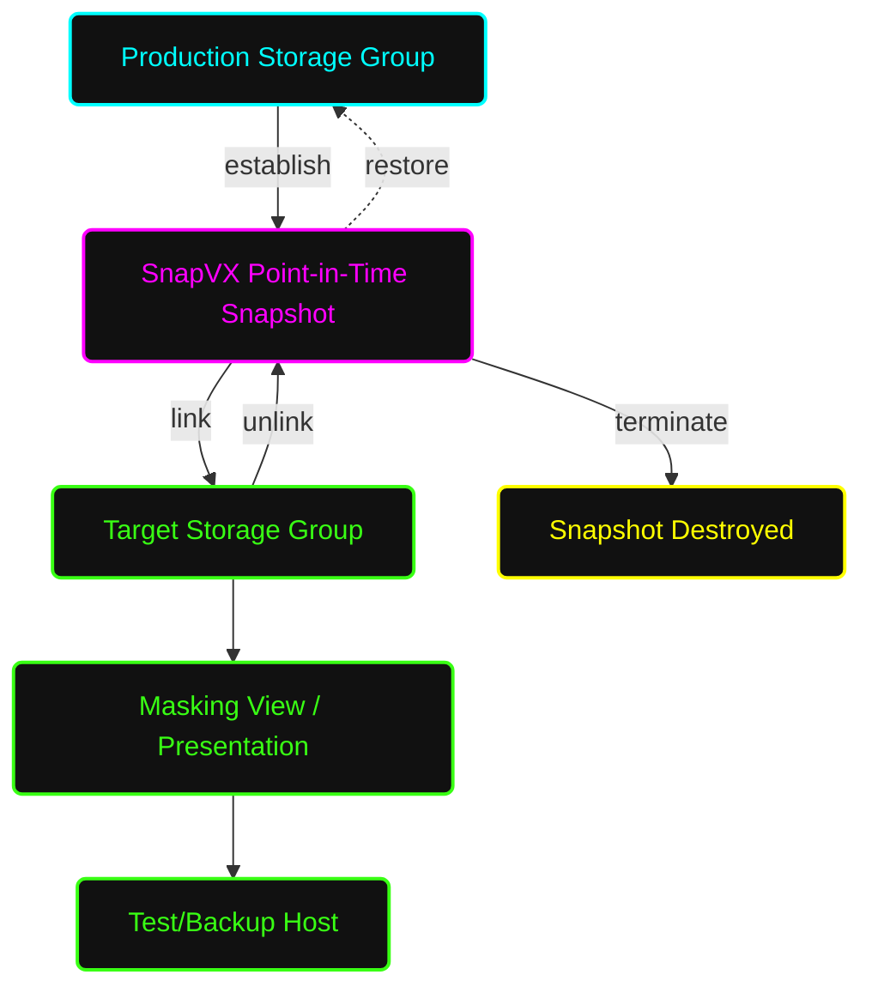

# 📸 Standard Operating Procedure: Complete SnapVX Management & Target Build

**System Architecture:** Dell EMC PowerMax / VMAX All Flash  
**Document Status:** Standard Operating Procedure (SOP)  
**Task Focus:** Local Replication (SnapVX) & Copy Data Management (From Scratch)  

---

## 📑 Table of Contents
1. [🎯 Purpose & Scope](#1-purpose--scope)
2. [📖 Layman's Glossary (Simple Explanations)](#2-laymans-glossary-simple-explanations)
3. [🗺️ SnapVX Logical Workflow (Mermaid)](#3-snapvx-logical-workflow-mermaid)
4. [🛑 Phase 1: Pre-Requisites & Validation](#4-phase-1-pre-requisites--validation)
5. [🏗️ Phase 2: Groundwork - Building Target Infrastructure](#5-phase-2-groundwork---building-target-infrastructure-from-scratch)
6. [📸 Phase 3: Creating a SnapVX Snapshot](#6-phase-3-creating-a-snapvx-snapshot)
7. [🔗 Phase 4: Linking to the Target (Test/Dev)](#7-phase-4-linking-to-the-target-testdev)
8. [🧹 Phase 5: Unlinking & Terminating](#8-phase-5-unlinking--terminating)
9. [⏪ Phase 6: Restoring a Storage Group](#9-phase-6-restoring-a-storage-group)
10. [🤖 Additional Information: Automated Target Device Creation](#10-additional-information-automated-target-device-creation)

---

<a name="1-purpose--scope"></a>
## 1. 🎯 Purpose & Scope
This SOP outlines the end-to-end procedure for configuring Dell EMC **TimeFinder SnapVX** entirely from scratch. SnapVX creates highly efficient, Redirect-on-Write (RoW) point-in-time copies of Storage Groups (SGs). Assuming you only have a Source (Production) Storage Group, this guide walks you through validating prerequisites, building the necessary target presentation infrastructure, taking the snapshot, linking it, and managing its lifecycle (including cleanup and restores).

---

<a name="2-laymans-glossary-simple-explanations"></a>
## 📖 2. Layman's Glossary (Simple Explanations)
If you are new to storage administration, here is what these technical terms actually mean in plain English:

* **SnapVX:** The software engine inside the storage array that takes "pictures" of your data.
* **Point-in-Time Snapshot:** Imagine taking a photograph of a spreadsheet at 12:00 PM. No matter how much you change the spreadsheet at 1:00 PM, the photograph still shows exactly what it looked like at 12:00 PM. 
* **Redirect-on-Write (RoW):** A space-saving trick. If you change a sentence in a document after taking a snapshot, the system doesn't erase the old sentence. Instead, it writes the new sentence on a blank sticky note and places it on top. The original snapshot still sees the old sentence underneath.
* **Storage Group (SG):** A logical folder or "bucket" that holds a specific group of hard drives (LUNs) meant for a single application or server.
* **Time-To-Live (TTL):** An expiration date or "self-destruct timer." It ensures you don't accidentally leave snapshots sitting around forever filling up your expensive storage.
* **Target SG / Linking:** Giving someone a photocopy of your snapshot to play with. You "link" the snapshot to a new, temporary bucket (Target SG) so a test server can read and write to it without ruining the original production data.
* **Initiator Group (IG):** The digital identity (WWNs) of the server you want to give the data to.
* **Port Group (PG):** The physical cables/ports on the storage array the server will plug into.
* **Masking View (MV):** The security guard and map. It ties the IG, PG, and SG together, telling the storage array exactly which server is allowed to see which bucket of data through which cables.
* **Restore:** The ultimate "Undo" button. This erases all current changes and forcefully rewinds the production data back to exactly how it looked in the snapshot.

---

<a name="3-snapvx-logical-workflow-mermaid"></a>
## 🗺️ 3. SnapVX Logical Workflow (Mermaid)



<a name="4-phase-1-pre-requisites--validation"></a>
## 4. 🛑 Phase 1: Pre-Requisites & Validation
### 4.1 Check Source Storage Group
Identify the production SG and ensure it is in a healthy state.
```bash
symsg -sid <SID> show <Production_SG_Name>
```

### 4.2 Verify Active Snapshots & Capacity
Before taking a new snapshot, check if previous snapshots exist and verify the array has sufficient Metadata and Storage Resource Pool (SRP) capacity.
```bash
symsnapvx -sid <SID> -sg <Production_SG_Name> list
symcfg -sid <SID> list -srp -detail
```
 * **Validation:** SRP utilization should ideally be below 80%. While snapshots are metadata-only at creation, subsequent host writes will consume SRP space.

<a name="5-phase-2-groundwork---building-target-infrastructure-from-scratch"></a>
## 5. 🏗️ Phase 2: Groundwork - Building Target Infrastructure (From Scratch)
If you only have a Production Storage Group, you must build the "Target Infrastructure" so the test/backup server has a place to receive the snapshot data. You only need to do this phase once per target server. If your target infrastructure already exists, skip to Phase 3.

### 5.1 Create the Target Storage Group (Empty)
You need a "bucket" to hold the linked snapshot. *Note: In modern PowerMaxOS, you do not need to manually create LUNs in this Target SG. The array will automatically generate identically sized LUNs during the linking process if the SG is empty.*
```bash
symsg -sid <SID> create <Target_SG_Name>
```

### 5.2 Create the Target Initiator Group (IG)
Define the test/backup server that will be accessing the snapshot using its WWNs.
```bash
symaccess -sid <SID> create -name <Test_IG_Name> -type initiator
symaccess -sid <SID> -name <Test_IG_Name> -type initiator add -wwn <Host_WWN>
```

### 5.3 Create the Target Port Group (PG)
Define the physical array ports the test server will communicate across.
```bash
symaccess -sid <SID> create -name <Test_PG_Name> -type port
symaccess -sid <SID> -name <Test_PG_Name> -type port add -dir <Dir> -port <Port>
```

### 5.4 Create the Target Masking View (MV)
Bind the Target SG, IG, and PG together so the test host is authorized to see the Target SG.
```bash
symaccess -sid <SID> create view -name <Test_MV_Name> -sg <Target_SG_Name> -pg <Test_PG_Name> -ig <Test_IG_Name>
```
*At this point, the Test Host can see the Target SG, but it is empty. Now we move on to taking the snapshot.*

<a name="6-phase-3-creating-a-snapvx-snapshot"></a>
## 6. 📸 Phase 3: Creating a SnapVX Snapshot
### 6.1 Establish the Snapshot with TTL
Always use a **Time-To-Live (TTL)**. This prevents forgotten snapshots from consuming array capacity indefinitely.
```bash
symsnapvx -sid <SID> -sg <Production_SG_Name> -name <Snapshot_Name> establish -ttl -val <Days> -type days
```
 * **Example:** Create a snapshot named DB_PrePatch_Snap that auto-expires in 7 days:
```bash
symsnapvx -sid 1234 -sg PROD_DB_SG -name DB_PrePatch_Snap establish -ttl -val 7 -type days
```

### 6.2 Verify Snapshot Creation
Ensure the snapshot state shows as **Established**.
```bash
symsnapvx -sid <SID> -sg <Production_SG_Name> list -detail
```

<a name="7-phase-4-linking-to-the-target-testdev"></a>
## 7. 🔗 Phase 4: Linking to the Target (Test/Dev)
Now we map the snapshot taken in Phase 3 into the Target SG.

### 7.1 Link the Snapshot
Link the snapshot to the target SG. The -copy flag is optional but recommended if the test host will heavily write to the linked devices (creates a full clone). For standard testing or backups, omit -copy for pointers only.
```bash
symsnapvx -sid <SID> -sg <Production_SG_Name> -snapshot_name <Snapshot_Name> link -lnsg <Target_SG_Name>
```

### 7.2 Present Target SG to Host (If MV not built in Phase 2)
If you skipped Phase 2 because the Target SG already existed but wasn't presented, add it to the Test Host's Masking View now:
```bash
symaccess -sid <SID> create view -name <Test_MV_Name> -sg <Target_SG_Name> -pg <Test_PG> -ig <Test_IG>
```

### 7.3 Rescan the Test Host
Because the Masking View is active, linking the snapshot automatically populates the LUNs for the host.
 * **Host Action:** Rescan the SCSI bus on the test host, discover the new disks, and mount the file systems.

<a name="8-phase-5-unlinking--terminating"></a>
## 8. 🧹 Phase 5: Unlinking & Terminating
When the test is complete or the backup is finished, you must clean up the relationships to free up system resources.

### 8.1 Unmount on Host
 * **Critical:** The Server Admin *must* unmount the filesystem/datastore on the Test Host before unlinking to prevent OS data corruption panics.

### 8.2 Unlink the Target SG
Sever the connection between the Snapshot and the Target SG. This empties the Target SG again.
```bash
symsnapvx -sid <SID> -sg <Production_SG_Name> -snapshot_name <Snapshot_Name> unlink -lnsg <Target_SG_Name>
```

### 8.3 Terminate the Snapshot (Manual Deletion)
If you did not use a TTL, or if you want to delete it before the TTL expires:
```bash
symsnapvx -sid <SID> -sg <Production_SG_Name> -snapshot_name <Snapshot_Name> terminate
```

<a name="9-phase-6-restoring-a-storage-group"></a>
## 9. ⏪ Phase 6: Restoring a Storage Group
**WARNING: This is a destructive action.** It will overwrite the current production data with the state of the snapshot.

### 9.1 Stop Host I/O
Shut down the application and unmount the filesystem on the Production Host to ensure cache is flushed and no inflight I/O is active.

### 9.2 Execute the Restore
```bash
symsnapvx -sid <SID> -sg <Production_SG_Name> -snapshot_name <Snapshot_Name> restore
```

### 9.3 Terminate the Restore Session
Once the data is fully restored and verified, terminate the restore relationship.
```bash
symsnapvx -sid <SID> -sg <Production_SG_Name> -snapshot_name <Snapshot_Name> terminate -restored
```
 * **Host Action:** Remount the production filesystems and start the application.

<a name="10-additional-information-automated-target-device-creation"></a>
## 10. 🤖 Additional Information: Automated Target Device Creation
**Who will create the devs in the target SG?**

The **PowerMax array itself (PowerMaxOS)** will automatically create the devices (devs/LUNs) in the Target SG. 

As the Storage Administrator, you do not need to manually create them. Here is exactly how it works behind the scenes:

1. **When it happens:** The exact moment you execute the `link` command (`symsnapvx ... link -lnsg <Target_SG_Name>`) in Phase 4.
2. **How it works:** The array looks at the snapshot and sees exactly how many devices are inside it, along with their exact sizes. Because your Target SG is empty, the array automatically provisions brand new target devices that are identical in size and quantity to the source devices, places them into the Target SG, and immediately links them to the snapshot data.
3. **Legacy vs. Modern:** In older VMAX environments (using TimeFinder Clone or BCVs), the Storage Admin had to manually calculate the sizes, manually run `symdev create`, and manually add those devs to the target SG before linking. Modern PowerMax eliminates this grunt work to prevent human error (like size mismatches) and save time. 

In short: You just build the "empty bucket" (the Target SG), and the `link` command automatically creates and places the perfectly sized devs inside it for you!
