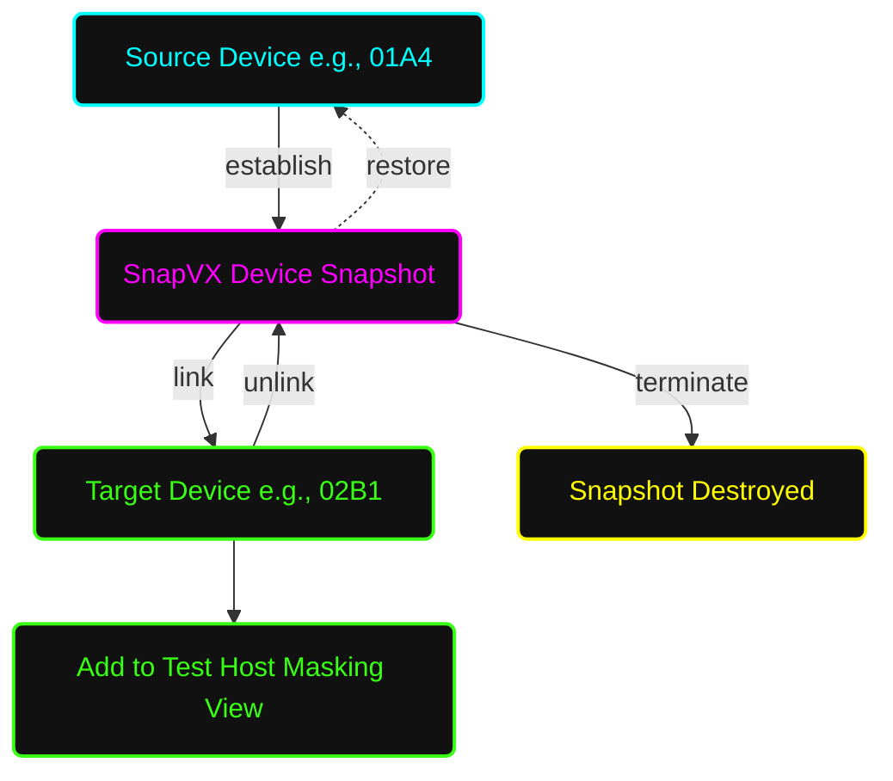

# 📸 Standard Operating Procedure: SnapVX Volume-Level (Device) Management

**System Architecture:** Dell EMC PowerMax / VMAX All Flash  
**Document Status:** Standard Operating Procedure (SOP)  
**Task Focus:** Local Replication (SnapVX) at the Single Device/Volume Level  

---

## 📑 Table of Contents
1. [🎯 Purpose & Scope](#purpose)
2. [📖 Layman's Glossary (Simple Explanations)](#glossary)
3. [🗺️ SnapVX Device-Level Workflow (Mermaid)](#workflow)
4. [🛑 Phase 1: Pre-Requisites & Validation](#phase1)
5. [🏗️ Phase 2: Preparing the Target Device](#phase2)
6. [📸 Phase 3: Creating a Volume-Level Snapshot](#phase3)
7. [🔗 Phase 4: Linking to the Target Device](#phase4)
8. [🧹 Phase 5: Unlinking & Terminating](#phase5)
9. [⏪ Phase 6: Restoring a Single Volume](#phase6)

---

<a name="purpose"></a>

## 1. 🎯 Purpose & Scope
This SOP outlines the end-to-end procedure for configuring and managing **TimeFinder SnapVX** at the **individual volume (device) level**. While Storage Group (SG) level snapshots are best for application consistency, device-level operations provide surgical precision when you only need to protect, clone, or restore a specific LUN without impacting the rest of an application's storage.

---

<a name="glossary"></a>

## 2. 📖 Layman's Glossary (Simple Explanations)
* **Device / Volume / LUN:** A single virtual hard drive presented to a server. Represented by a 4-digit hexadecimal ID (e.g., `01A4`).
* **Source Device:** The original production drive you want to take a picture of.
* **Target Device:** A blank drive created specifically to hold the cloned data from the snapshot.
* **Point-in-Time Snapshot:** A frozen, exact replica of the Source Device at the exact second the command is run.
* **Linking:** Connecting the invisible snapshot to the physical Target Device so a test server can read and write to it.
* **Restore:** Erasing all current data on the Source Device and replacing it with the data from the snapshot.

---

<a name="workflow"></a>

## 3. 🗺️ SnapVX Device-Level Workflow (Mermaid)



---

<a name="phase1"></a>

## 4. 🛑 Phase 1: Pre-Requisites & Validation

### 4.1 Check Source Device Status
Identify the specific Device ID (e.g., `01A4`) and verify its size and status.
```bash
symdev -sid <SID> show <Source_Dev_ID>
```

### 4.2 Verify Array Capacity
Ensure the array has sufficient Storage Resource Pool (SRP) capacity to handle the snapshot metadata and any Redirect-on-Write changes.
```bash
symcfg -sid <SID> list -srp -detail
```

---

<a name="phase2"></a>

## 5. 🏗️ Phase 2: Preparing the Target Device
**CRITICAL DIFFERENCE:** Unlike Storage Group operations where the array automatically creates target devices for you, volume-level linking requires you to explicitly define an existing target device. **The target device must be the exact same size and emulation type as the source device.**

### 5.1 Create the Target Device
Create a new device matching the exact size of the Source Device. (Note the resulting Device ID, e.g., `02B1`).
```bash
symdev -sid <SID> create -srp <SRP_Name> -cap <Size> -captype <GB|MB|CYL> -emulation FBA
```

### 5.2 Add Target Device to a Storage Group (For Masking)
To present this new Target Device to a test host, it must reside in a Storage Group connected to that host's Masking View.
```bash
symsg -sid <SID> -sg <Test_Host_SG> add dev <Target_Dev_ID>
```

---

<a name="phase3"></a>

## 6. 📸 Phase 3: Creating a Volume-Level Snapshot

### 6.1 Establish the Snapshot with TTL
Create the snapshot against the specific device using the `-devs` flag. Always apply a Time-To-Live (TTL).
```bash
symsnapvx -sid <SID> -devs <Source_Dev_ID> -name <Snapshot_Name> establish -ttl -val <Days> -type days
```
* **Example:**
```bash
symsnapvx -sid 1234 -devs 01A4 -name Vol_01A4_PrePatch establish -ttl -val 3 -type days
```

### 6.2 Verify Snapshot Creation
Ensure the snapshot state shows as **Established** for that specific device.
```bash
symsnapvx -sid <SID> -devs <Source_Dev_ID> list -detail
```

---

<a name="phase4"></a>

## 7. 🔗 Phase 4: Linking to the Target Device

### 7.1 Link the Snapshot to the Target Device
Use the `-tgt_devs` flag to map the snapshot to the blank target device you created in Phase 2.
```bash
symsnapvx -sid <SID> -devs <Source_Dev_ID> -snapshot_name <Snapshot_Name> link -tgt_devs <Target_Dev_ID>
```

### 7.2 Rescan the Test Host
Because the Target Device is in the Test Host's Storage Group, it is now readable/writable.
* **Host Action:** Rescan the SCSI bus on the test host and mount the file system.

---

<a name="phase5"></a>

## 8. 🧹 Phase 5: Unlinking & Terminating

### 8.1 Unmount on Host
* **Critical:** The Server Admin must unmount the filesystem/datastore on the Test Host before unlinking to prevent OS data corruption panics.

### 8.2 Unlink the Target Device
Sever the connection between the Snapshot and the Target Device.
```bash
symsnapvx -sid <SID> -devs <Source_Dev_ID> -snapshot_name <Snapshot_Name> unlink -tgt_devs <Target_Dev_ID>
```

### 8.3 Terminate the Snapshot (Manual Deletion)
Delete the snapshot manually to free up array resources before the TTL expires.
```bash
symsnapvx -sid <SID> -devs <Source_Dev_ID> -snapshot_name <Snapshot_Name> terminate
```

### 8.4 Clean Up Target Device (Optional)
If you no longer need the Target Device, remove it from the SG and delete it to reclaim space.
```bash
symsg -sid <SID> -sg <Test_Host_SG> remove dev <Target_Dev_ID>
symdev -sid <SID> free -devs <Target_Dev_ID>
```

---

<a name="phase6"></a>

## 9. ⏪ Phase 6: Restoring a Single Volume
**WARNING:** This is a destructive action that will instantly overwrite the current data on the Source Device with the snapshot data.

### 9.1 Stop Host I/O
Shut down the application and unmount the filesystem on the Production Host that uses this specific volume.

### 9.2 Execute the Restore
```bash
symsnapvx -sid <SID> -devs <Source_Dev_ID> -snapshot_name <Snapshot_Name> restore
```

### 9.3 Terminate the Restore Session
Once the state is restored, clear the restore relationship.
```bash
symsnapvx -sid <SID> -devs <Source_Dev_ID> -snapshot_name <Snapshot_Name> terminate -restored
```
* **Host Action:** Remount the production filesystem on the host and start the application.
