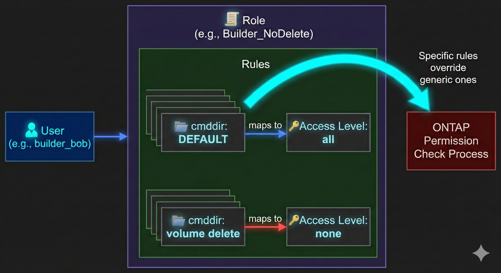

# 🔐 NetApp ONTAP: Master Role-Based Access Control (RBAC) 🛡️

**Stop giving everyone "admin" access!** 🛑 
Security 101 says "Least Privilege." If a junior admin only needs to check volume space, they shouldn't have the power to delete the entire cluster. 

This guide walks you through creating custom Roles, Users, and locking down your NetApp cluster like a fortress.

---

## 🧠 1. The Core Concepts
*Before we type, let's understand the hierarchy.*

* **👤 User:** The human (or script) logging in.
* **📜 Role:** A collection of permissions (What commands can they run?).
* **📂 Command Directory (cmddir):** The specific command path you are allowing or blocking (e.g., `volume show` vs `volume delete`).
* **🔑 Access Level:** `all`, `readonly`, or `none`.

---

## 🛠️ 2. Creating a Custom Role
*Let's create a role called "Level1_Support" that can view everything but touch nothing.*

```bash
# 1. Create the base role with DEFAULT access (usually 'none' to start safe)
security login role create -role Level1_Support -cmddir DEFAULT -access none

# 2. Grant Read-Only access to the entire command structure
security login role create -role Level1_Support -cmddir "DEFAULT" -access readonly

# 3. Wait! We want them to be able to make specific network changes? 
# Let's give them FULL access specifically to network commands.
security login role create -role Level1_Support -cmddir "network interface" -access all

# 4. BUT... strictly forbid them from deleting volumes (even if they have other rights)
security login role create -role Level1_Support -cmddir "volume delete" -access none
```

> **Note:** ONTAP processes rules from specific to general. A specific rule for `volume delete` overrides a general rule for `volume`.

---

## 👤 3. Creating the User & Assigning the Role
*Now that the hat (Role) is made, let's put it on a head (User).*

```bash
# 1. Create the user 'junior_admin' for SSH access
security login create -user-or-group-name junior_admin -application ssh -authmethod password -role Level1_Support

# 2. Create the user 'monitoring_script' for API (REST/ONTAPI) access
security login create -user-or-group-name monitoring_bot -application http -authmethod password -role Level1_Support

# 3. Unlock the user (if they get locked out later)
security login unlock -username junior_admin
```

---

## 🔑 4. Setting the Password
*The user is created, but they need a secret handshake.*

```bash
# Set the password for the new user
security login password -username junior_admin
```

---

## 🕵️‍♂️ 5. Verification: Did it work?
*Check your work before you hand over the credentials.*

```bash
# List all users and their roles
security login show

# Inspect the specific rules of your new role
security login role show -role Level1_Support

# Test the access (Simulate a command as that role)
# (This isn't a direct command, but you can verify by logging in as the user in a new terminal)
```

---

## 🚀 6. Advanced: Restricting access to a specific SVM
*Sometimes you want a tenant admin to manage THEIR data (SVM) but not the whole cluster.*

```bash
# Create a role constrained to a specific Vserver (SVM)
security login role create -vserver <SVM_Name> -role SVM_Admin -cmddir DEFAULT -access none
security login role create -vserver <SVM_Name> -role SVM_Admin -cmddir volume -access all
security login role create -vserver <SVM_Name> -role SVM_Admin -cmddir network -access readonly

# Create the user tied to that SVM
security login create -vserver <SVM_Name> -user-or-group-name tenant_admin -application ssh -authmethod password -role SVM_Admin
```

---

## 🧹 7. Cleanup
*Made a mistake? Here is how to delete the evidence.*

```bash
# Delete the user
security login delete -username junior_admin

# Delete the role (Only works if no users are currently assigned to it!)
security login role delete -role Level1_Support
```

---


# 🛡️ Just as an example NetApp RBAC: The "Builder" Role (Create All, Delete Nothing) 🏗️

This configuration creates a role that allows an admin to configure storage, networking, and SVMs ("Create Everything") but prevents them from destroying data or configurations ("Delete Nothing").

---

## 📜 1. The Strategy
ONTAP processes permissions from **Specific** to **Generic**. 
1. First, we grant `access all` to the entire system (`DEFAULT`).
2. Then, we apply `access none` to specific `delete` command paths.

---

## 🛠️ 2. The Configuration Script
*Run these commands in your ONTAP CLI.*

```bash
# --- Step 1: Create the Base Role (Allow Everything) ---
# Start by giving full power. This allows create, modify, show, AND delete.
security login role create -role Builder_NoDelete -cmddir DEFAULT -access all

# --- Step 2: The "Safety Locks" (Block Deletes) ---
# Now, we explicitly DENY access to the 'delete' command for critical areas.

# 💾 STORAGE OBJECTS (Protect Data)
security login role create -role Builder_NoDelete -cmddir "volume delete" -access none
security login role create -role Builder_NoDelete -cmddir "lun delete" -access none
security login role create -role Builder_NoDelete -cmddir "volume snapshot delete" -access none
security login role create -role Builder_NoDelete -cmddir "volume clone split stop" -access none
security login role create -role Builder_NoDelete -cmddir "qtree delete" -access none

# 🌐 NETWORKING (Protect Connectivity)
security login role create -role Builder_NoDelete -cmddir "network interface delete" -access none
security login role create -role Builder_NoDelete -cmddir "network port delete" -access none
security login role create -role Builder_NoDelete -cmddir "network route delete" -access none

# 🏢 INFRASTRUCTURE (Protect the System)
security login role create -role Builder_NoDelete -cmddir "vserver delete" -access none
security login role create -role Builder_NoDelete -cmddir "cluster unjoin" -access none
security login role create -role Builder_NoDelete -cmddir "system node halt" -access none
security login role create -role Builder_NoDelete -cmddir "system node reboot" -access none

# 🔐 SECURITY (Prevent them from deleting other admins!)
security login role create -role Builder_NoDelete -cmddir "security login delete" -access none
```
*Sulthan Sharief K S*
