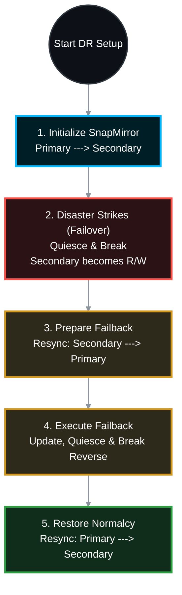

# 🔄 NetApp ONTAP: End-to-End SnapMirror Replication & Disaster Recovery SOP 🛡️

This Standard Operating Procedure (SOP) details the complete lifecycle of a NetApp SnapMirror relationship, strictly adhering to ONTAP 9 enterprise disaster recovery guidelines. It covers the initial baseline, the DR failover process (breaking the mirror), and the critical failback sequence (re-establishing the original replication direction without performing a full baseline transfer).

> 🏷️ **Rule:** All commands are executed from the **Destination Cluster** unless explicitly stated otherwise. Replace placeholders (e.g., `<SRC_SVM>`, `<DST_VOL>`) with your environment variables.

## 📑 Table of Contents
1. [🤝 Phase 1: Prerequisites & Peering Validation](#phase-1)
2. [🏗️ Phase 2: SnapMirror Setup & Initialization](#phase-2)
3. [🚨 Phase 3: DR Failover (Breaking the Mirror)](#phase-3)
4. [🔄 Phase 4: DR Failback (Restoring the Primary Site)](#phase-4)

---




---

<a id="phase-1"></a>
## 🤝 Phase 1: Prerequisites & Peering Validation
*Before creating a SnapMirror relationship, the physical clusters and the logical Storage Virtual Machines (SVMs) must be securely peered.*

### 1.1 Validate Cluster Peering
*(Run on either cluster)*
```bash
cluster peer show
```
* **Target:** `Peer State` must be `peered` and `Availability` must be `Available`.

### 1.2 Validate SVM Peering
*(Run on the Destination Cluster)*
```bash
vserver peer show
```
* **Target:** `Peer State` must be `peered` and `Applications` must include `snapmirror`.

---

<a id="phase-2"></a>
## 🏗️ Phase 2: SnapMirror Setup & Initialization
*Establishing the baseline transfer from the Primary (Source) to the DR (Destination) site.*

### 2.1 Create the Destination Volume
*(Run on the Destination Cluster)*
The destination volume must be created as type `DP` (Data Protection) and be equal to or larger than the source volume.
```bash
volume create -vserver <DST_SVM> -volume <DST_VOL> -aggregate <DST_AGGR> -size <SIZE> -type DP
```

### 2.2 Create the SnapMirror Relationship
*(Run on the Destination Cluster)*
Bind the source and destination volumes using a specific policy and schedule.
```bash
snapmirror create -source-path <SRC_SVM>:<SRC_VOL> -destination-path <DST_SVM>:<DST_VOL> -type DP -policy MirrorAllSnapshots -schedule hourly
```

### 2.3 Initialize the SnapMirror (Baseline Transfer)
*(Run on the Destination Cluster)*
This triggers the initial block-for-block copy.
```bash
snapmirror initialize -destination-path <DST_SVM>:<DST_VOL>
```

### 2.4 Validate Initialization
```bash
snapmirror show -destination-path <DST_SVM>:<DST_VOL> -fields state,status,lag-time
```
* **Target:** `State` transitions from `Uninitialized` to `Snapmirrored`. `Status` should return to `Idle` once the baseline completes.

---

<a id="phase-3"></a>
## 🚨 Phase 3: DR Failover (Breaking the Mirror)
*A disaster has struck the Primary site. You must sever the replication tie to make the Destination volume Read/Write accessible to clients.*

### 3.1 Quiesce the Relationship
*(Run on the Destination Cluster)*
Pause any active or queued transfers. (Skip if the Primary cluster is completely dead/unreachable).
```bash
snapmirror quiesce -destination-path <DST_SVM>:<DST_VOL>
```
* **Verify:** `snapmirror show` should display Status as `Quiesced`.

### 3.2 Break the SnapMirror Relationship
*(Run on the Destination Cluster)*
This converts the Destination volume from Read-Only (`DP`) to Read/Write (`RW`).
```bash
snapmirror break -destination-path <DST_SVM>:<DST_VOL>
```

### 3.3 Mount and Redirect Clients
*(Run on the Destination Cluster)*
Mount the volume into the DR SVM namespace and redirect your DNS/Clients.
```bash
volume mount -vserver <DST_SVM> -volume <DST_VOL> -junction-path /<JUNCTION_PATH>
```
*The DR site is now actively serving data.*

---

<a id="phase-4"></a>
## 🔄 Phase 4: DR Failback (Restoring the Primary Site)
*The Primary site is repaired. We must sync the changed data from the DR site back to the Primary site, and then reverse the roles back to their original state.*

> ⚠️ **CRITICAL WARNING:** Resyncing overwrites the data on the target volume. Ensure you are issuing the commands in the correct direction.

### 4.1 Resync Data: DR Site ---> Primary Site (Reverse Resync)
*(Run on the ORIGINAL Source Cluster)*
This establishes a reverse SnapMirror, syncing the delta changes made during the DR event back to the original source volume.
```bash
# Delete the stale relationship metadata on the original source (if it still exists)
snapmirror delete -source-path <SRC_SVM>:<SRC_VOL> -destination-path <DST_SVM>:<DST_VOL>

# Initiate the Reverse Resync (Original Source becomes the temporary destination)
snapmirror resync -source-path <DST_SVM>:<DST_VOL> -destination-path <SRC_SVM>:<SRC_VOL>
```
*Wait for this transfer to complete (`State: Snapmirrored`, `Status: Idle`).*

### 4.2 Halt DR Client Access & Final Update
*(Run on the Destination Cluster / DR Site)*
To prevent split-brain, stop clients from writing to the DR site, unmount the volume, and run one final update.
```bash
# 1. Unmount the volume to stop client I/O
volume unmount -vserver <DST_SVM> -volume <DST_VOL>

# 2. Push the final delta (Run from the ORIGINAL Source Cluster)
snapmirror update -source-path <DST_SVM>:<DST_VOL> -destination-path <SRC_SVM>:<SRC_VOL>
```

### 4.3 Break the Reverse Relationship
*(Run on the ORIGINAL Source Cluster)*
Make the original Primary volume Read/Write again.
```bash
snapmirror quiesce -destination-path <SRC_SVM>:<SRC_VOL>
snapmirror break -destination-path <SRC_SVM>:<SRC_VOL>
```
*You can now mount the original volume and point clients back to the Primary site.*

### 4.4 Restore Normalcy: Primary Site ---> DR Site (Original Resync)
*(Run on the Destination Cluster / DR Site)*
Now that the Primary site is active, resync the DR site so it is protected once again.
```bash
# Delete the temporary reverse relationship metadata
snapmirror delete -source-path <DST_SVM>:<DST_VOL> -destination-path <SRC_SVM>:<SRC_VOL>

# Resync back to the original direction
snapmirror resync -source-path <SRC_SVM>:<SRC_VOL> -destination-path <DST_SVM>:<DST_VOL>
```

### 4.5 Final Validation
*(Run on the Destination Cluster)*
```bash
snapmirror show -destination-path <DST_SVM>:<DST_VOL>
```
* **Target:** `Mirror State: Snapmirrored`, `Relationship Status: Idle`. The environment is 100% restored to its pre-disaster state.

---
*Would you like me to map out the specific commands for utilizing `snapmirror update -ls-set` when failing over load-sharing mirrors (root volumes) during this process?*
