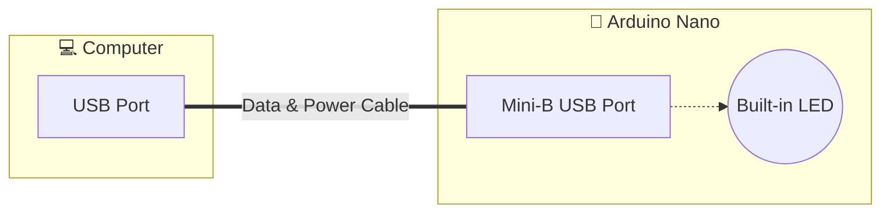
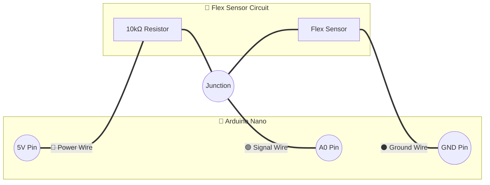
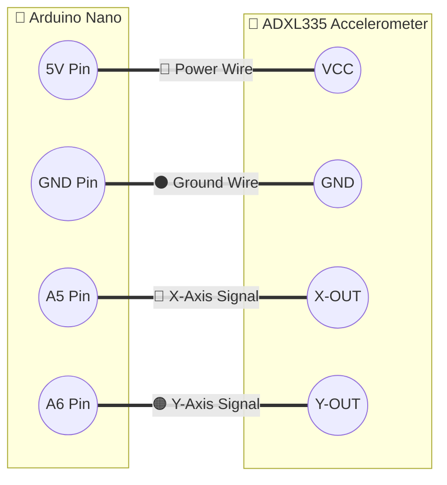
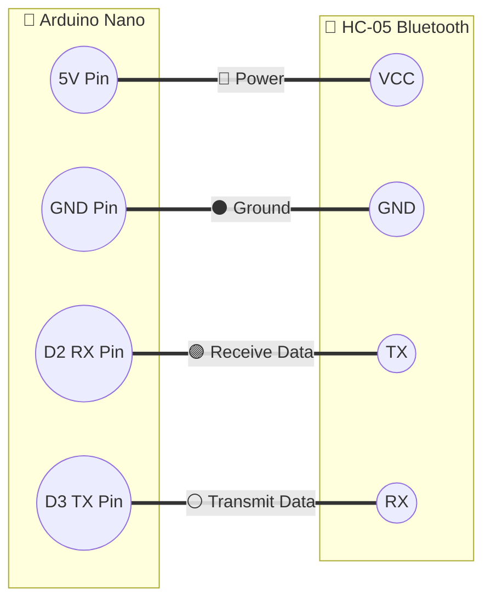

# 🛠️ Smart Glove Component Testing Guide

Before wiring the entire smart glove circuit together, it is critical to test each component individually to ensure they are functioning properly. 

### 💻 Prerequisites: Software Setup
1. **Download Arduino IDE:** Head over to the official Arduino website and install the Arduino IDE. 
2. **Connect the Board:** Plug your Arduino Nano into your computer using a Mini-B USB cable.

---

### 🧠 1. Testing the Arduino Nano
[cite_start]The Arduino Nano is the central microcontroller [cite: 41-44]. We need to ensure it can communicate with your computer.



* **Test Steps:**
    1. Open the Arduino IDE.
    2. Go to **Tools > Board** and select **Arduino Nano**.
    3. Go to **Tools > Port** and select the active COM port.
    4. Go to **File > Examples > 01.Basics > Blink**.
    5. Click the **Upload** button.
* **🎉 Success:** The built-in LED on the Nano should start blinking continuously.

---

### 🤌 2. Testing the Flex Sensors (Voltage Divider)
The glove uses five flex sensors. [cite_start]The sensor's resistance changes when the plastic strip holding the carbon surface bends [cite: 28-29]. To read this, connect one pin to GND, and the other to an analog pin and to 5V through a 10kΩ resistor.



* **Test Code:**
  ```cpp
  void setup() {
    Serial.begin(1200); 
  }
  void loop() {
    int flexValue = analogRead(A0); 
    Serial.println(flexValue);
    delay(100);
  }
  ```
* **🎉 Success:** Open the **Serial Monitor** (set to 1200 baud). As you physically bend the sensor, the printed numbers should change roughly linearly. [cite_start]Repeat for pins A1, A2, A3, and A4 to test all five fingers [cite: 81-85].

---

### 📐 3. Testing the ADXL335 Accelerometer
This 3-axis MEMS accelerometer measures static and dynamic acceleration to determine the hand's tilt. The VCC connects to 5V, GND to GND, and the X and Y outputs go to analog pins A5 and A6.



* **Test Code:**
  ```cpp
  void setup() {
    Serial.begin(1200);
  }
  void loop() {
    int xVal = analogRead(A5); 
    int yVal = analogRead(A6); 
    Serial.print("X: "); Serial.print(xVal);
    Serial.print(" | Y: "); Serial.println(yVal);
    delay(200);
  }
  ```
* **🎉 Success:** Open the Serial Monitor. Pick up the accelerometer and tilt it. [cite_start]The analog X and Y values will change proportionally to the acceleration along those axes [cite: 40, 98-99].

---

### 📶 4. Testing the HC-05 Bluetooth Module
The HC-05 handles wireless serial connections. The software serial configuration for this project uses digital pins 2 and 3.



* **Test Steps:** 1. Power the Arduino via USB. The LED on the HC-05 will blink rapidly.
  2. Open your smartphone's Bluetooth settings and scan for new devices.
  3. Select "HC-05" and enter the default PIN (usually `1234` or `0000`).
* **🎉 Success:** The module pairs successfully with your phone, and the fast-blinking LED on the HC-05 slows down, confirming the connection.

Would you like me to draft the full unified circuit layout for the final build next?
